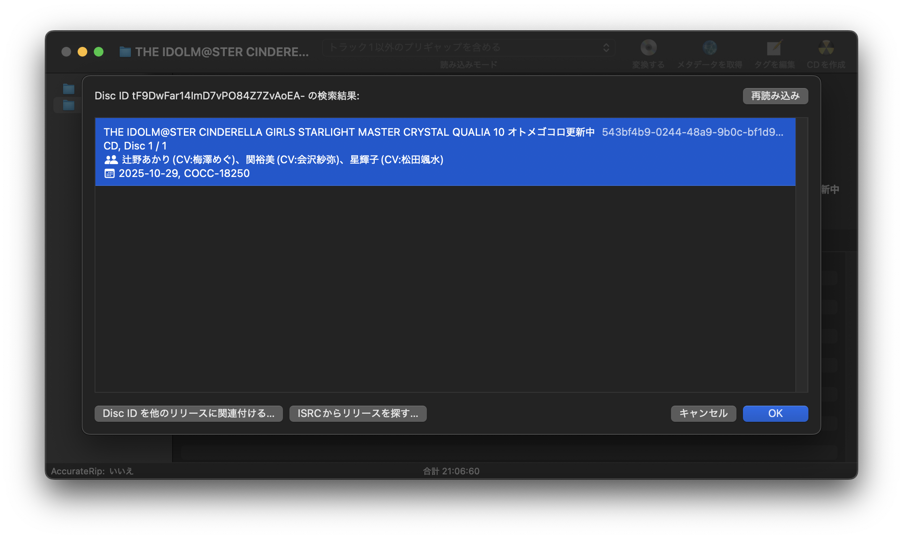

# XLDSomeTweaksPlugin

XLD の一部動作を変更するプラグインです。

## Tweaks

### MusicBrainzからISRCを読み込まないようにする

XLD は CD に ISRC 情報が存在しない場合に MusicBrainz の Recording に登録されている ISRC を書き込みますが、これを無効化します。

(推奨しませんが、MusicBrainz 上の ISRC をあとから書き込みたくなった場合、MusicBrainz Picard を通すと書き込むことができます)

### 新・MusicBrainz照会ダイアログ

「メタデータを取得」時に SomeTweaksPlugin 独自の MusicBrainz 照会ダイアログを表示します。
複数のバージョンが存在する場合に手元の CD と合致するバージョンを選択しやすくなるほか、Disc ID が既に登録されている場合も他のリリースに Disc ID を関連付けることができます (XLD標準では既にリリースに紐付いている Disc ID を他のリリースに紐付けることができなかったため、従来は MusicBrainz Picard などの別アプリを使う必要があった)。

副作用として、これを有効化している間は MusicBrainz 以外のソース (CDDB) からの取得ができなくなります。
